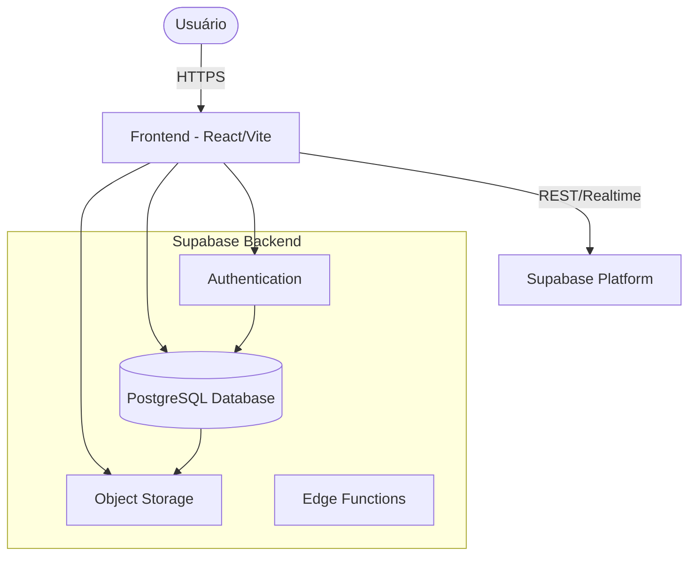

# 02. Arquitetura do Sistema

## Visão Macro

O sistema GPCS é uma aplicação web monolítica (frontend) conectada a um backend serverless (Supabase). A arquitetura é centrada em dados, onde a lógica de negócio reside tanto no frontend (React) quanto no banco de dados (RLS, Triggers, Functions).



## Camadas da Aplicação

### 1. Frontend (Client-Side)
- **Framework**: React 18 com TypeScript.
- **State Management**: Context API (`AuthContext`, `SettingsContext`).
- **Data Fetching**: Cliente Supabase (`@supabase/supabase-js`) com hooks personalizados.
- **Routing**: React Router v6.
- **UI Components**: Componentes reutilizáveis em `src/components`, estilizados com Tailwind CSS.

### 2. Backend (Serverless & Database)
- **Autenticação**: Gerenciada pelo Supabase Auth (GoTrue).
- **Autorização**: Implementada via Row Level Security (RLS) diretamente no PostgreSQL.
- **API**: O PostgREST expõe automaticamente o banco de dados como uma API REST segura.
- **Storage**: Buckets para armazenamento de arquivos, protegidos por políticas de storage.

## Fluxo de Dados

1. **Autenticação**: O usuário faz login e recebe um JWT.
2. **Requisição**: O frontend envia o JWT em cada requisição para o Supabase.
3. **Validação**: O Supabase valida o token e extrai o `user_id` e `role`.
4. **Execução de Query**: O banco de dados executa a query, aplicando as políticas RLS baseadas no usuário autenticado.
5. **Retorno**: Apenas os dados permitidos são retornados ao frontend.

## Estrutura de Diretórios (Source Code)

```
/src
  /assets        # Imagens e arquivos estáticos
  /components    # Componentes React reutilizáveis
    /ui          # Componentes base (Botões, Inputs, Modais)
  /contexts      # Estado global (Auth, Theme)
  /hooks         # Custom hooks (e.g., useNetworkStatus)
  /lib           # Utilitários e configurações (supabase client, types)
  /pages         # Componentes de página (rotas)
    /activities  # Telas do módulo de atividades
    /admin       # Telas de administração
    /auth        # Telas de login/recover
    /dashboard   # Telas de dashboard
    /documents   # Telas do módulo de documentos
  /styles        # Arquivos CSS globais
```

## Segurança

A segurança é garantida principalmente através do RLS. Nenhum dado sensível é exposto sem verificação de identidade.

- **Autenticação**: JWT seguro.
- **Autorização**: Políticas SQL granulares (veja `doc/03_BANCO_DE_DADOS.md`).
- **Validação de Input**: Zod (se aplicável) e validação HTML5 no frontend; Constraints e Checks no banco de dados.
